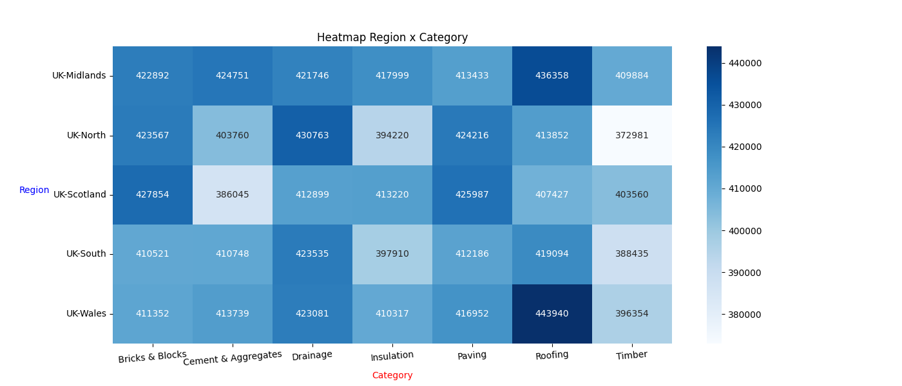

# Raport de concluzii bazat pe Analiza Strocuri SKU - Regiuni si Categorii

## Descriere
Acest proiect analizeaza distributia stocurilor de produse (SKU-uri) pe regiuni, cu accent pe:
- niveluri de **high stock**
- niveluri de **low stock**
- distributia volumelor de **categorii de produse si regiuni**

Scopul este identificarea riscurilor de stock-out si a zonelor care necesita optimizare a aprovizionarii.

---

## Regiuni analizate:

- UK-Midlands
- UK-North
- UK-Scotland
- UK-South
- UK-Wales

## Categorii analizate
- Bricks & Blocks
- Cement & Aggregates
- Drainage
- Insulation
- Paving
- Roofing
- Timber

---

## Vizualizari

### Procent SKU cu Stoc Ridicat (High Stock)

### Procent SKU cu Stoc Scazut (Low Stock)

### Distributie Regiune x Categorie (Heatmap)

---

## Observatii si concluzii

### 1. Regiunile cu cel mai mare numar de produse (High Stock)
- **UK-Midlands** si **UK-Wales** prezinta cele mai mari procente de SKU-uri aflate in high stock.
- Diferentele intre regiuni sunt moderate, indicand o distributie relativ echilibrata a stocurilor mari.

---

### 2. Regiunile cu cea mai mare pondere de Low Stock
- **UK-North** si **UK-South** au cele mai ridicate procente de produse aflate in low stock.
- Aceste regiuni reprezinta un risc operational crescut si necesita:
  - reaprovizionare prioritare
  - revizuire forecast-ului de cerere
  - redistribuirea stocurilor intre regiuni.

---

## Concluzie generala:
- Stocurile sunt relativ bine distribuite la nivel national, insa exista **zone critice la nivel de regiune si categorie**.
- Focusul operational ar trebui sa fie pe:
- UK-North si UK-South
- O strategie de reaprovizionare si balansare a regiunilor ar trebui luata in calcul.